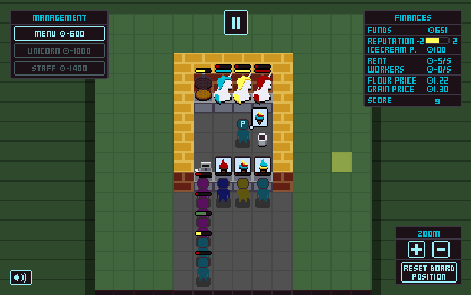

# Rainbow Cream

> *Every scoop is magical.*

Run your own enchanted icecream shop where you take colorful swirls out of unicorns' asses! 
Customers just keep lining up craving those tasty rainbow swirls! And it's up to you to keep your unicorns humming, your staff darting about the shop, and your reputation sparkling!
Grow your dream shop into the most magical dessert destination around! 
But beware — rent is due, supplies cost money, and one unhappy customer can sour your good name in a heartbeat.

You can play a live version here: https://igorfie.gitlab.io/rainbow-cream/

This game was created for the [2026 js13kGames](https://js13kgames.com/) where the theme was `Unicorns and Rainbows`.

## Game instructions
**Goal:** Serve as many customers as possible without running out of `funds` or `reputation`.

- Customers arrive wanting ice creams with specific color/flavor combinations (blue, yellow, red). Their patience bar drains over time — serve them before it empties or they leave and your `reputation` drops.
- Slow service costs you `reputation` while fast services earn you `tips`.
- Grab a cone from the cone machine, scoop each requested flavor color, then deliver it to the right customer. 
- A wrong order can be tossed in the bin.
- `Reputation` sets how much you can charge and how many customers show up. But watch out for how much you charge your customers. With bad `reputation` your customers aren't willing to pay high values for your ice creams.

**Management menus**:
- **Menu:** Toggle active flavors, set max flavors per order and set your ice cream price.
- **Unicorn Handling:** Speed up each unicorn color's production.
- **Staff:** Hire ice cream workers, cashiers, and supply workers.

**Controls:**
- Click/tap tiles and buttons to interact.
- `pause` button to help you manage the shop.
- Drag or swipe the board to move/reposition it.
- Zoom `+`/`−` and `Reset Board Position` to help the player adjust the game board.
- To mute the game, click on the `Speaker` icon.

**Game Over:** 
- Funds hit 0 *or* reputation hits 0.

## TODO-FOR-FUTURE-ME
- Refactor/reorganize all the code
- new upgrade `BUILDING`, which would allow the player to edit and costumize the game board, add more unicorns, more cashiers, etc. Which would increase the managing options of the game.
- new upgrade `BREEDING`, which would allow the player to breed unicorn making more colors to add them to the icecream flavours.

### Setup
Run `npm install` in a terminal

### Development
Run `npm run start` to start the game on a development server on `localhost:8080`.

### Production
Use `npm run build` to create a minified file and zip it with the `index.html`. The result will be available in the `build` directory.